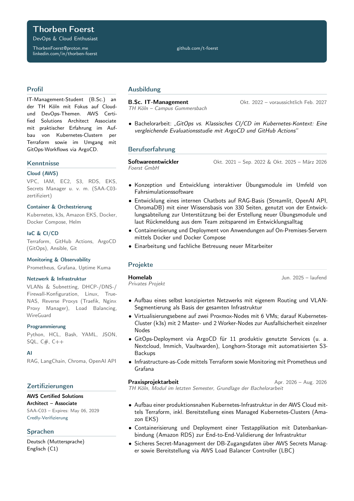

# cv

My CV, version-controlled — English and German.

<p align="center">
  
  
</p>

<p align="center">
  <a href="preview/cv_de.pdf">Download PDF (German)</a> ·
  <a href="preview/cv_en.pdf">Download PDF (English)</a>
</p>

## Build

```sh
python3 scripts/generate.py
```

Translates (if `content.de.json` changed since the last translation, via
DeepL — needs `DEEPL_API_KEY` in `.env`; skipped, not fatal, if missing or
offline, reusing the previous `output/content.en.json`), renders both
`.tex` files, and compiles `output/cv_de.pdf` / `output/cv_en.pdf`.
